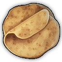

# Shared Mods For Anno 1800 by Taludas
In this repo you can find all of my Shared Mods

## Products and Productions

Product mods contain product asset, icon, storage list, expedition values and Docklands information if applicable - at least a fake factory for `IsMainFactory` handling.

Production mods contain production buildings in one region and sometimes a chain menu with an unlock. In general Products are not unlocked automatically, you need to unlock them yourself, if you use the products.

| | Name | GUID | Product | Production |
---|---|---|---|---|
 | Almonds | 1999005084 | `Taludas_sharedproduct_almonds`| `Taludas_shared_importdock_almonds` |
 | Apple Cider | 1999005051 | `sharedproduct_applecider_taludas` |  |
 | Avocados | 1999002209 | `sharedproduct_avocados_taludas` | `sharedproduction_avocados_taludas`
| Diamonds | 1999005087 | `Taludas_sharedproduct_diamonds` | `Taludas_shared_importdock_diamonds`
 | Ebony | 1999005093 | `Taludas_sharedproduct_ebony` | `Taludas_shared_importdock_ebony`
 | Fish Stew | 1999005054 | `sharedproduct_fishstew_taludas` |  |
 | Guacamole | 1999002215 | `sharedproduct_guacamole_taludas` | `sharedproduction_guacamole_taludas`
 | Honey | 1440232 | `sharedproduct_honey_taludas` | (`New Horizons`, Asia)
 | Lacquerware | 1999005078 | `sharedproduct_lacquerware_taludas` |
 | Limestone (renamed cement) | 1010231 | `sharedproduct_limestone_taludas` | vanilla
 | Lobster Dinner | 1999005075 | `sharedproduct_lobsterdinner_taludas` |
 | Luxury Furniture | 1999005072 | `sharedproduct_luxuryfurniture_taludas` |
 | Marzipan | 1999005057 | `sharedproduct_marzipan_taludas` |
 | Paintings | 1999005069 | `sharedproduct_paintings_taludas` |
 | Potash | 1999002211 | `sharedproduct_potash_taludas` | `sharedproduction_potash_taludas`
| Saffron | 1999005090 | `Taludas_sharedproduct_saffron` | `Taludas_shared_importdock_saffron`
| Silk Fabric | 1440209 | `Taludas_sharedproduct_silkfabric` | `Taludas_shared_importdock_silk`<br/>(`New Horizons`, Asia)
| Soda | 1999002300 | `sharedproduct_soda_taludas` | (`lion053_Enbesa_Spectacles_Production`, Enbesa)<br/>(`shared_soda_factory_kurila`, Old World)
| Sweets | 1999005060 | `sharedproduct_sweets_taludas` |
 | Tortillas | 1999002213 | `sharedproduct_tortillas_taludas` | `sharedproduction_tortillas_taludas`
| Wine (renamed Champagne) | 120016 | `sharedproduct_wine_taludas` | vanilla

## Foreign Trading Company

In close cooperation, Drakkam, Taubenangriff and me created the **Foreign Trading Company** as an Import/Export facility with extra steps. This feature will be shared by the mods "Noblesse Oblige" (Taludas), "Merchants" (Drakkam) and "New Horizons" (Taubenangriff) and be open to others as well.


### *How does it work?*
New products must be imported through coastal **import docks**, where they can be bought for **trade licenses**. This is completely independent of any 3rd party or the Docklands system, the results will hopefully be a nice contrast to the vanilla Docklands, because the extra steps we took allow for complex interaction with the game world.

For example see the usage in "Noblesse Oblige": You start by exporting some of your industrial products, like steel, via one of the export docks. Those produce Trade Licenses, consuming a few tons of input product at different rates. The more valuable the input, the better the dock. For example the Steel export is the most basic one, exchanging 10t of Steel for one Trade License every 2 minutes.

The Trade Licenses received will be stored in a special warehouse to increase your stock independently of the island-wide warehouse. This stock is also used for imported products.

Trade Licences can now be used to purchase foreign and exotic products from different regions of the world. Depending on the rarity of the product in question, you will have different import speeds and quantities. For example: Saffron is the most expensive import product in Noblesse Oblige.

### *How does it interact with other mods?*
While the Landowners of "Noblesse Oblige" consume Silk f.e., they don't offer the production itself, only importing it. That void is deliberate. And as soon as you enter Asia in "New Horizons, it is filled by the local Silk production chain. When playing with both mods, you get the choice of either Import or Production, with production being the preferred and more effective method. The neat part: You ain't forced into installing anything! it is your choice which mods to play with, but as you install multiple mods, they can interconnect their products without the need for every single mod to offer standalone production, profiting of each other without forced dependency.

### *How do I use the shared mod for my own mod?*
1. Download the main shared mod `Taludas_shared_tradingcompany` as well as `Taludas_neutral_airport` and integrate it in your mod. Also add it to the `ModDependencies` and `LoadAfterIds` in your modinfo.json file.
2. Do you want to use the build-in Export Docks to get you started on Trade License generation? Then include the Docks you want to use in the module sub menu of the Main Building:

```xml
<ModOp Type="add" GUID="1999005385" Path="/Values/ModuleOwner/ConstructionOptions" Condition="!~/Values/ModuleOwner/ConstructionOptions/Item[ModuleGUID = '1999005382']">
    <Item>
        <ModuleGUID>1999005382</ModuleGUID>
    </Item>
</ModOp>
```
Available Export Docks in the main mod:

| | Name | GUID | Product | Production
---|---|---|---|---|
 | Steel | 1010219 | vanilla | vanilla
| Cannons | 1010221 | vanilla | vanilla
 | Sewing Machines | 1010206 |vanilla | vanilla
| Dynamite | 1010222 | vanilla | vanilla
| Steam Engines | 1010224 | vanilla | vanilla
| Typewriters | 135230 | vanilla (DLC 09) | vanilla (DLC 09)

You will also need to put custom triggers for Unhide/Unlock and a custom build menu entry for the main building as well as the Export Docks into your mod.

3. You want to use one of the shared Import Docks or one of the shared support modules? Just include the specific submods (product, import dock and import storage list submods are needed!) into your mod and add it to the `ModDependencies` and `LoadAfterIds` in your modinfo.json file. Note, that after the main mod `Taludas_shared_tradingcompany` you should first load any support modules and then Import Docks should be loaded after both of them in their own modinfo.json (therfore the sorting of modules will be "Warehouse", "Support Modules", "Export Docks", "Import Docks"). Have a look inside the available modinfo.json files to copy the behaviour to your mod and check in game if the order is correct. Import Docks in general are loaded and sorted alphabetically. Available submods in this repo:

| | Name | GUID | Product | Production | Import Storage List
---|---|---|---|---|---|
 | Almonds | 1999005084 | `Taludas_sharedproduct_almonds`| `Taludas_shared_importdock_almonds` | `import_storagelist_almonds_taludas`
| Diamonds | 1999005087 | `Taludas_sharedproduct_diamonds` | `Taludas_shared_importdock_diamonds` | `import_storagelist_diamonds_taludas`
 | Ebony | 1999005093 | `Taludas_sharedproduct_ebony` | `Taludas_shared_importdock_ebony` | `import_storagelist_ebony_taludas`
| Saffron | 1999005090 | `Taludas_sharedproduct_saffron` | `Taludas_shared_importdock_saffron` | `import_storagelist_saffron_taludas`
| Silk Fabric | 1440209 | `Taludas_sharedproduct_silkfabric` | `Taludas_shared_importdock_silk`<br/>(`New Horizons`, Asia) | `import_storagelist_silk_taludas`
| Tea | 1500010847 | `tea-jakob` | `Taludas_shared_importdock_tea`<br/>(`ow-tea-jakob`) | `import_storagelist_silk_taludas`
|||||||
 | Handling Pier | 1999005388 | requires `ropes-jakob`,`ow-ropes-jakob`,`barrels_kurila`,`shared_cooperages_kurila` | `Taludas_shared_tradingcompany_packaging` |

You will also need to put custom triggers for Unhide/Unlock for the Import Docks into your mod.

4. You want to create a new import product? Just copy over one of the shared import product submods and the corresponding Import Dock submod and edit it to your liking. Don't forget to set up `ModDependencies` and `LoadAfterIds` in your modinfo.json file and include a custom trigger for Unhide/Unlock for the Import Dock and its product into your mod. If you want to keep the submods compatible with other mods, that might add your import product's production chain later, you will also need to set up a separate submod equivalent to the contents of `import_storagelist_importproduct_taludas`, that loads after all other mods (use `LoadAfterIds = "*"`).

```xml
    <!-- Add Import Product 'x' to the trading company Storage list if not already present in the StandardStorageProductList -->
    <ModOp Type="add" GUID="1999005354" Path="/Values/ProductStorageList/ProductList" Condition="!//Values[Standard/GUID='120055']/ProductStorageList/ProductList/Item[Product='importproduct_GUID']">
        <Item>
            <Product>importproduct_GUID</Product>
        </Item>
    </ModOp>
```
This way you make sure, that IF a product is also produced by an existing production chain, it does not suffer from the lower storage amount of the Foreign Trading Company's Warehouse, but uses the standard warehouse stock to unload.

## UI mods
In this repo you will also find a collection of available submods to alter and in general streamline certain UIs of the vanilla game to be used in more than the specific vanilla usecase. Available submods in this repo:

| Name | UI | changes to the UI |
---|---|---|
`Taludas_neutral_aftermonumentevent_festivalreward_infotip` | Reward Buff Effect Football Stadium | changed text and icon to be more neutral toward being used by a lot different events.
`Taludas_neutral_airport` | Airship Landing Platform | removed background image and change button descriptions to be more neutral toward being used by a lot different main building + modules combinations.
`neutral_hacienda_genshi` | Hacienda | removed background image and change several button icons and descriptions to be more neutral toward being used by a lot different Hacienda like main building + modules combinations.
`Taludas_neutral_irontower_workforceslider` | Iron Tower | changed text on the Iron Tower workforce allocation slider to be neutral toward being used by ALL workforces and not only Tourists.
